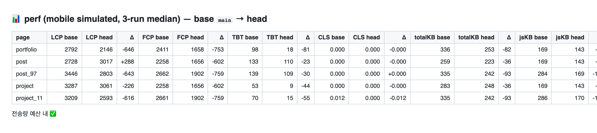

# M'log

개인 포트폴리오 + 기술 블로그. https://minginew.netlify.app

공개 페이지(포트폴리오·프로젝트·글)와 관리자 페이지(로그인, 글·프로젝트 작성, 썸네일 업로드)로 구성.

[](https://github.com/minginew/fe-portfolio/actions/workflows/ci.yml)

## 스택


| Area | Stack |
|---|---|
| Backend | Supabase(Auth·DB·Storage). 서버 없이 프런트에서 직접 호출, 권한은 RLS |
| Content | 관리자 에디터 Tiptap / 읽기 전용 뷰어 DOMPurify + highlight.js |

## 구조

```
frontend/
  src/            앱 코드 (pages, components, redux/api, util)
  src/test/       Vitest 설정, MSW 핸들러·픽스처
  e2e/            Playwright 시나리오
  scripts/perf/   Lighthouse 측정·비교·예산 스크립트
  scripts/assets/ 폰트 서브셋·이미지 변환 스크립트
.github/workflows/ CI, Supabase keep-alive
```

## 실행

```bash
cd frontend
npm install
npm run dev        # http://localhost:5173
npm run build      # tsc + vite build → dist/
npm run preview    # dist/ 미리보기 (4173)
```

`frontend/.env`:

```
VITE_SUPABASE_URL = ...
VITE_SUPABASE_KEY = ...   # anon key
```

## 테스트

```bash
npm test           # 단위·컴포넌트 (Vitest, jsdom, MSW로 Supabase 요청 차단)
npm run e2e        # Playwright (Chrome, 데스크톱·모바일), 실제 Supabase 사용
```

관리자 E2E는 `E2E_ADMIN_EMAIL`/`E2E_ADMIN_PASSWORD`가 있을 때만 실행되고, 만든 글은 `[e2e] ` 접두어로 구분해 종료 시 삭제한다.

## CI

PR마다 세 job이 돈다.

| job   | 내용                                                                                                                                                                          |
| ----- | ----------------------------------------------------------------------------------------------------------------------------------------------------------------------------- |
| check | lint → prettier → tsc → vitest(coverage) → build                                                                                                                              |
| e2e   | Playwright                                                                                                                                                                    |
| perf  | base·head를 각각 빌드해 Lighthouse(모바일, 3회 중앙값)로 5페이지 측정 → Δ 표와 번들 크기 표를 PR 코멘트로. 전송량이 `scripts/perf/budget.json`을 넘으면 실패, LCP 초과는 경고 |



## 성능

과거 최적화를 전부 원복해 기준점을 잡고, 항목마다 PR 하나로 단독·누적 효과를 측정해 채택 여부를 정했다. 실측으로 뺀 항목도 리포트에 남겼다.

로컬 Lighthouse 5회 중앙값(모바일 시뮬레이션). 기준점 → 최종.

| page       | LCP            | 전송량        |
| ---------- | -------------- | ------------- |
| /portfolio | 5575 → 1976 ms | 1546 → 253 KB |
| /post/97   | 5130 → 2727 ms | 683 → 242 KB  |
| /project   | 7329 → 3056 ms | 1104 → 248 KB |

항목별 측정과 판단 근거는 [docs/performance](docs/performance/README.md) 참고.

## 라이선스

폰트 MuseoModerno — SIL Open Font License 1.1 (`frontend/src/assets/fonts/OFL.txt`)
